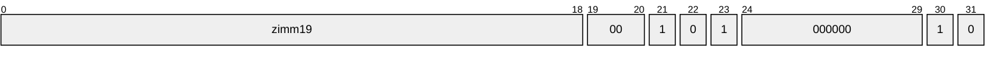
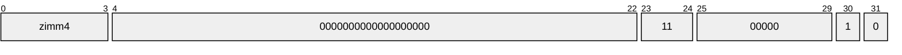
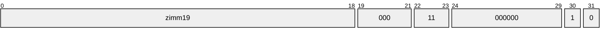
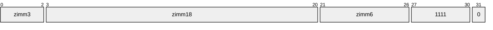

# Instructions

There are a few instructions on the IPU that do not appear in the documentation, or do appear without some important details.

## `delay`
**Format**: `delay zimm19`
**Example Encoding** `20 00 a0 40`

Delay execution for a fixed amount of time.

## `sync`
**Format**: `sync zimm4`
**Example Encoding**: `03 00 80 41`
**Example Disassembly**: `sync 3`


Wait for/synchronize on a condition specified by the operand. The operand is 4-bit, and values are defined in the `TileSyncZone` enum:


## `sans`
**Format**: `sans zimm19`
**Example Encoding** `20 00 c0 40`


Unknown function. We think it allows for synchronizing against multiple things at the same time? It standing for "Sync ANS" is probably a red herring.

#### findings
The IPU access library has the following string hidden inside it (a legend for a routine that prints the status of all tiles)
```
  X     (non debug) exception
  x     debug exception (trap)
  r     waiting on sync (receiving data)
  :     waiting on multiple syncs (sans instruction)
  '     waiting on local sync (workers in tile)
  .     waiting on internal sync (other tiles within IPU)
  AB    waiting on external sync including host (A=GSP1, B=GSP2)
  abcd  waiting on external sync excluding host (a=GSP1, b=GSP2, ...)
  *     executing (some other instruction)
  -     tile unloaded
  ?     inaccessible / unknown
```

## `send`
**Format**: `send zimm6, zimm18, zimm3`
**Example Encoding**: `33 00 20 78`
**Example Disassembly**: `send 1, 6, 3`

Most likely sends the queued data in [[csr#`$OUTGOING_BASE (0xa7)`|$OUTGOING_BASE]]. The first argument might be a notification for whether the tile has more data to send. The second argument may be an offset from $OUTGOING_BASE? The third's use is entirely unclear.